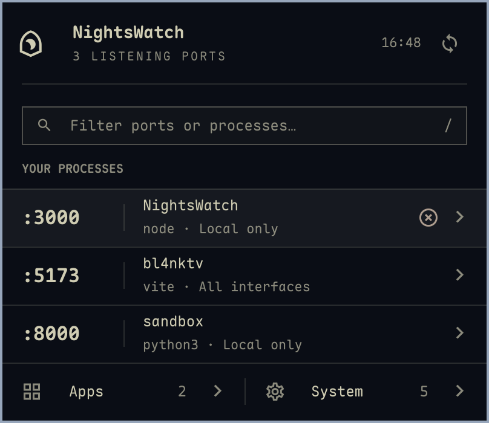
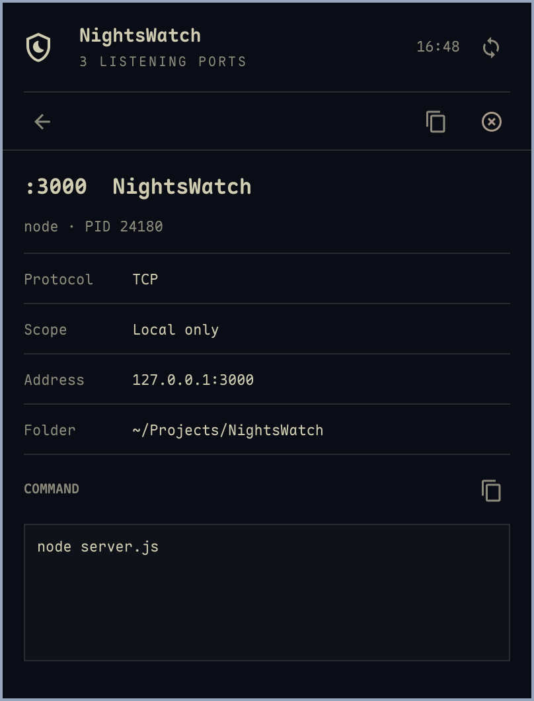

# NightsWatch

A native [Omarchy](https://omarchy.org/) bar plugin for inspecting listening ports and stopping the processes behind them. Follows your desktop theme.



## Install

```sh
omarchy plugin add https://github.com/yenst/NightsWatch.git --enable
```

Requires Omarchy's Quickshell-based shell, Hyprland, Python 3.9+ with Linux pidfd support, `ss` (iproute2), and `wl-copy` (wl-clipboard). No extra daemon or privileged setup.

## Use

- Click the Ethernet icon in the bar. Middle-click refreshes.
- Search by port, process, project, address, protocol, PID, command, or folder.
- Click a row for process details. Copy address and stop actions stay at the top; long commands have their own scroll area and copy action.
- Hover a row to reveal the kill icon. **Clicking it immediately sends SIGTERM to the process, affecting all its ports. There is no confirmation.**
- **Apps** groups your windowed applications using Hyprland's window PID. **System** groups other users' listeners and those with unavailable ownership. Your other listeners appear in the main list.

The timestamp beside refresh shows the last successful scan. Refresh runs every 3 seconds while open and every 15 seconds while closed.

| Key | Action |
| --- | --- |
| `/` | Focus search |
| Up / Down | Select a row |
| Enter | Inspect selected row |
| Delete | Immediately stop the selected process |
| Escape | Go back or close |
| Tab | Move between controls |

<details>
<summary>Process detail view</summary>



</details>

## Why does a port appear twice?

Each row represents a distinct protocol, address, port, and process binding. A process listening on both `127.0.0.1:3300` and `[::1]:3300` has separate IPv4 and IPv6 rows. TCP and UDP listeners on the same number are also separate. Open details to see the exact binding.

**Local only** means loopback. **All interfaces** means a wildcard bind, not necessarily internet reachability. **Specific address** means an explicit non-loopback bind.

## Update or remove

```sh
omarchy plugin update yenst.nightswatch
omarchy plugin remove yenst.nightswatch
```

If the shell keeps showing old components after an update, run `omarchy restart shell`.

## Migrating from the original plugin ID

If you installed the early `jihmy.nightswatch` version, reinstall once under the new ID:

```sh
omarchy plugin remove jihmy.nightswatch
omarchy plugin add https://github.com/yenst/NightsWatch.git --enable
```

Future updates use `omarchy plugin update yenst.nightswatch`.

## Implementation

Short-lived Python helpers read `ss`, Hyprland's window list, and `/proc`. Stopping checks ownership and process start time, then signals a pinned process descriptor. No sudo, force-kill, or process-group kill. Processes may ignore SIGTERM; the list reflects whether they actually exit.

Up to 500 socket bindings are shown. Commands are capped at 2,048 characters and folder paths at 1,024. Failed scans keep the previous inventory and display an error. Window matching uses exact PIDs, so separate application helper processes may appear in the main list.

See [CONTRIBUTING.md](CONTRIBUTING.md) for local installation and tests.

Inspired by [Portwatch](https://github.com/ZerubbabelT/portwatch), with a fresh implementation and a design based on Framework Fans and Dicta. Licensed under [MIT](LICENSE).
