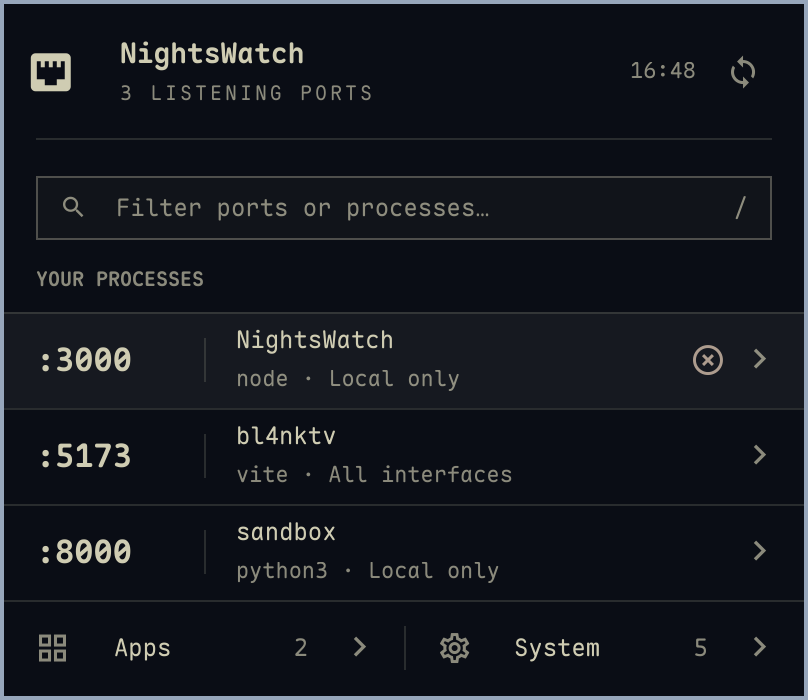

# NightsWatch

A native Omarchy bar plugin for listening ports. Designed alongside Framework Fans and Dicta: a compact charcoal panel, clear process rows, and the active desktop theme.



## Use

- Click the Ethernet icon in the bar to open NightsWatch. Middle-click refreshes.
- Filter by port, process, project, address, protocol, PID, command, or folder.
- Click a row to inspect the process, command, working directory, and address. Addresses can be copied; details are selectable.
- Hover a row to reveal the icon-only stop action. Clicking it immediately sends SIGTERM to the owning process, affecting all its ports. There is no confirmation dialog.
- Apps contains listeners owned by your windowed applications, matched by Hyprland PID. System contains listeners owned by other users or with unavailable ownership information. The main list shows your other listening processes.
- Local only means loopback. All interfaces means a wildcard bind; this does not establish internet reachability. Specific address means an explicit non-loopback bind.
- Arrow keys select rows, Enter inspects, `/` focuses search, Delete stops the selected process immediately, and Escape goes back or closes. Tab reaches controls. There is no keyboard-hint footer.

The timestamp beside refresh is the last successful scan time. Scans run every 3 seconds while open and every 15 seconds while closed, with no overlapping scans. The icon stays available when no development ports are listening.

## Requirements

Omarchy with its Quickshell shell, Hyprland, Python 3 with Linux pidfd support, `ss` (iproute2), and `wl-copy` (wl-clipboard). All are standard on the development machine. No additional daemon or network service is installed.

## Install a local checkout

```sh
python3 scripts/install.py
omarchy plugin enable jihmy.nightswatch --section right --after jihmy.fw-fanctrl
```

The installer validates and copies this plugin to `~/.config/omarchy/plugins/jihmy.nightswatch`; rerun it after local edits. If Quickshell retains old component sizing, run `omarchy restart shell` once to clear its component cache. Existing unrelated files are not removed. It does not modify packaged Omarchy files or use symlinks. Enable placement can be changed with the Omarchy bar controls.

For a published Git repository, use `omarchy plugin add <repository-url> --yes`, then enable the plugin as above. This checkout has not been published.

Remove with `omarchy plugin remove jihmy.nightswatch`.

## Behavior and limits

TCP listeners and unconnected UDP sockets are listed. Distinct addresses and owners remain separate, so a process listening on IPv4 and IPv6 can have two rows. Up to 500 listeners are shown. Command text is capped at 2,048 characters; folder paths at 1,024. Detail actions stay at the top. Long command text scrolls inside its own bounded area and can be copied. Other long details scroll beneath the fixed toolbar. If window classification fails, a message is shown and accessible listeners remain visible. Failed scans retain the previous inventory and timestamp with an explicit error.

Stopping is restricted to your user, uses a pinned process descriptor, and checks process start time before signaling. Stale identities, inaccessible processes, and unsupported safe termination fail closed. No sudo, force-kill, or process-group kill is used. A successful request means the signal was sent; the process can take time to exit or ignore SIGTERM.

## Development

```sh
omarchy plugin validate .
python3 -m unittest discover -s tests -v
python3 scripts/test_ui.py
```

The integration tests create and stop only their own disposable processes. Listener integration requires local socket access. The UI harness renders the actual QML using controlled data and exercises filtering, selection, detail navigation, immediate stopping and ownership guards, categories, and disappearing listeners. Generated captures are written into a temporary directory.

Implementation: `Panel.qml` integrates the bar and keyboard popup; `Content.qml` owns the view; `Service.qml` runs short-lived helpers; `scripts/ports.py` handles listener discovery and safe signaling. Icons come from Omarchy's installed Material Design Nerd Font glyph library.

Inspired by [Portwatch](https://github.com/ZerubbabelT/portwatch), with a fresh implementation and the user's fanctrl/Dicta visual references. The approved design is saved in `design/approved.png`.
